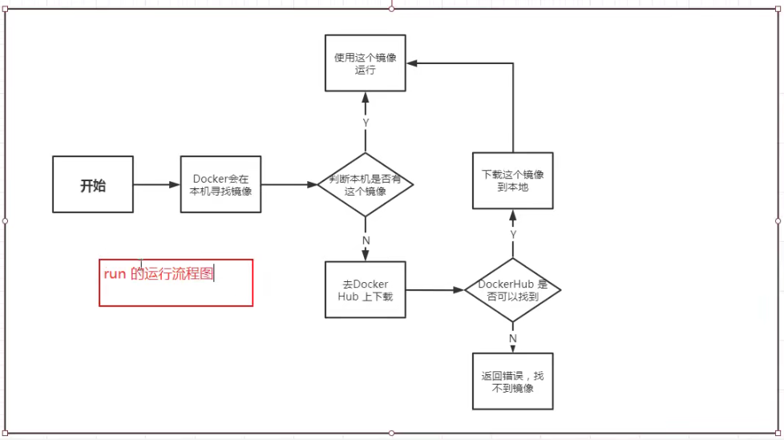
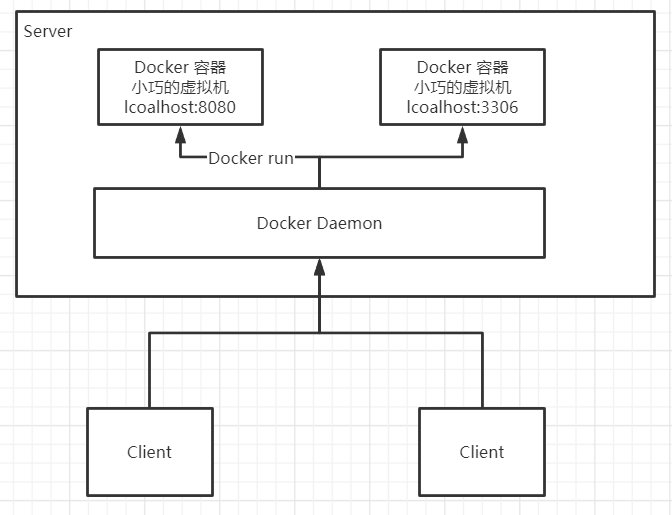
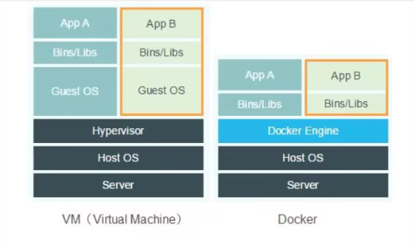
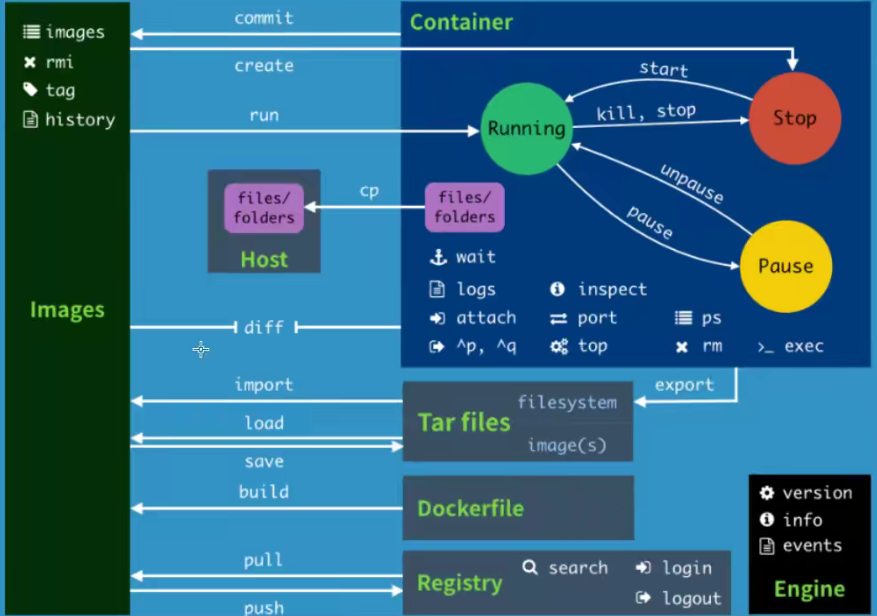
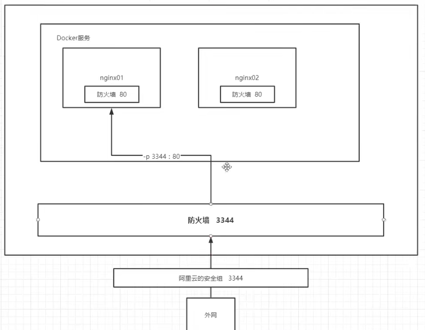
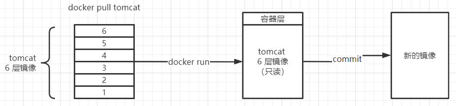

*弱小和无知不是生存的障碍，傲慢才是*


# Docker 概述

## Docker为什么出现？

一款产品开发、线上至少有两套环境，每一台机器都要配置环境，费时费力，并且有一些配置时不跨平台的。

java -> api -> 发布（应用商店） -> 下载api -> 安装即用

java -> jar -> 打包项目带上环境（镜像）-> Docker仓库（商店）-> 下载我们发布的镜像 -> 直接运行

Docker的思想打包装箱，互相隔离。通过隔离机制，将服务器利用到极致！


## Docker历史

2010 公司成立

2013 开源

2014 Docker 1.0 发布


> 聊聊Docker 

Docker 是 go 语言开发

https://docs.docker.com/  官方文档，非常详细

https://hub.docker.com/ Docker镜像仓库，有 push 和 pull 操作


## Docker对比

| Feature        | Vwware虚拟机软件 | Docker     |
| -------------- | ---------------- | ---------- |
| 实现方式       | 虚拟化技术       | 容器化技术 |
| 隔离           | 是               | 是         |
| 完整的操作系统 | 是               | 否         |
| 资源占用       | 几G              | 几M        |
| 启动           | 几分钟           | 几秒       |
| 操作步骤       | 冗余步骤多       | 无         |


> 容器化架构对比

|        | 容器化                               | 虚拟化                     |
| ------ | ------------------------------------ | -------------------------- |
| 内核   | 没有自己的内核，直接依赖宿主机的内核 | 虚拟硬件，有完整的操作系统 |
| 环境库 | 每个容器有独立的环境库               | 共享环境库                 |
| 隔离性 | 容器之间互相隔离，且有自己的文件系统 | 没有隔离环境               |


## Docker用途

> DevOps（两个单词组合    开发、运维）

1. 应用更快速的交付和部署

传统：一堆帮助文档，安装程序

Docker：打包镜像发布测试，一键运行


2. 更便捷的升级和扩容

使用Docker之后，部署应用就和搭积木一样

环境升级、水平扩容


3. 更简单的系统运维

在容器化之后，我们的开发、测试环境都高度一致


4. 更高效的计算资源利用

Docker 是内核级别的虚拟化，可以在一个物理机上运行很多的容器实例！服务器的性能可以压榨到极致


## Docker名词

1. 镜像：Images，相当于 Java 的类

Docker 镜像相当于模板，通过运行镜像创建多个容器


2. 容器：Containers，相当于 Java 的对象（类的实例化）

Docker利用容器技术，独立运行一个或一组应用，容器由镜像创建。

启动、停止、删除

可以理解容器是一个简易的linux操作系统


3. 仓库：Repository

仓库是存放镜像的地方

仓库分为共有仓库和私有仓库

需要配置镜像加速


# Docker安装

> 基于 CentOS 7 安装

1. 官网安装参考手册：https://docs.docker.com/engine/install/centos/

2. 确定你是CentOS7及以上版本，系统内核是 3.10 以上

    ```
    [root@centos7 ~]# cat /etc/redhat-release
    CentOS Linux release 7.9.2009 (Core)
    [root@centos7 ~]# uname -r
    3.10.0-1127.19.1.el7.x86_64
    ```

3. yum安装gcc相关

    ```
    yum -y install gcc
    yum -y install gcc-c++
    ```

4. 卸载旧版本

    ```
    yum -y remove docker docker-common docker-selinux docker-engine
    # 官网版本
    yum remove docker \
              docker-client \
              docker-client-latest \
              docker-common \
              docker-latest \
              docker-latest-logrotate \
              docker-logrotate \
              docker-engine
    ```

5. 安装需要的软件包

    ```
    yum install -y yum-utils device-mapper-persistent-data lvm2
    ```

6. 设置镜像仓库

    ```
    # 正确推荐使用国内的
    yum-config-manager --add-repo http://mirrors.aliyun.com/docker-ce/linux/centos/docker-ce.repo
    ```

7. 更新yum软件包索引（因为上面更新了yum源）

    ```
    yum makecache fast
    ```

8. 安装Docker CE （C E表示Community Edition）

    ```
    yum -y install docker-ce docker-ce-cli containerd.io
    ```

9. 启动docker

    ```
    systemctl start docker
    ```

10. 测试

    ```shell
    docker version
    docker run hello-world #使用镜像
    docker images #查看已下载的镜像
    #--------------------------------------------------
    
    [root@centos7 ~] docker run hello-world
    Unable to find image 'hello-world:latest' locally
    latest: Pulling from library/hello-world
    b8dfde127a29: Pull complete
    Digest: sha256:9f6ad537c5132bcce57f7a0a20e317228d382c3cd61edae14650eec68b2b345c
    Status: Downloaded newer image for hello-world:latest
    
    Hello from Docker!
    This message shows that your installation appears to be working correctly.
    
    To generate this message, Docker took the following steps:
     1. The Docker client contacted the Docker daemon.
     2. The Docker daemon pulled the "hello-world" image from the Docker Hub.
        (amd64)
     3. The Docker daemon created a new container from that image which runs the
        executable that produces the output you are currently reading.
     4. The Docker daemon streamed that output to the Docker client, which sent it
        to your terminal.
    
    To try something more ambitious, you can run an Ubuntu container with:
     $ docker run -it ubuntu bash
    
    Share images, automate workflows, and more with a free Docker ID:
     https://hub.docker.com/
    
    For more examples and ideas, visit:
     https://docs.docker.com/get-started/
    
    #--------------------------------------------------
    
    root@centos7 ~] docker images
    REPOSITORY    TAG       IMAGE ID       CREATED        SIZE
    hello-world   latest    d1165f221234   3 months ago   13.3kB
    ```

11. 卸载Docker
    ```shell
    #卸载依赖
    sudo yum remove docker-ce docker-ce-cli containerd.io
    #删除资源
    rm -rf /var/lib/docker
    rm -rf /var/lib/containerd
    ```


## Docker 镜像加速

阿里云和腾讯云都有 docker 镜像加速服务

[腾讯云Docker文档](https://cloud.tencent.com/document/product/1207/45596?from=information.detail.%E8%85%BE%E8%AE%AF%E4%BA%91%E5%8A%A0%E9%80%9Fdocker)


## 回顾HelloWorld




## 底层原理

Docker 是 C/S 架构

	


**Docker 为什么比 VM 快？**

	

* Docker 有着比虚拟机更少的抽象层
* 容器是运行在 Docker 服务上的
* Docker 利用宿主机的内核，VM 需要完整的操作系统。所以，新建一个容器的时候，Docker 不需要向虚拟机一样重新加载一个操作系统内核。


# Docker常用命令

## 帮助命令

```shell
docker version
docker info
docker 命令 --help
```

帮助文档地址 https://docs.docker.com/reference/


## 镜像命令

**docker search 查询镜像**

```shell
[root@centos7 ~] docker search mysql --filter=stars=3000
NAME      DESCRIPTION                                     STARS     OFFICIAL   AUTOMATED
mysql     MySQL is a widely used, open-source relation…   11034     [OK]
mariadb   MariaDB Server is a high performing open sou…   4181      [OK]
```


**docker pull 下载镜像**

```shell
[root@centos7 ~] docker pull mysql:5.7.34   # 指定tag（版本），默认 latest
5.7.34: Pulling from library/mysql
b4d181a07f80: Pull complete
a462b60610f5: Pull complete        			# 分层下载，docker image 核心，联合文件系统
578fafb77ab8: Pull complete
524046006037: Pull complete
d0cbe54c8855: Pull complete
aa18e05cc46d: Pull complete
32ca814c833f: Pull complete
52645b4af634: Pull complete
bca6a5b14385: Pull complete
309f36297c75: Pull complete
7d75cacde0f8: Pull complete
Digest: sha256:1a2f9cd257e75cc80e9118b303d1648366bc2049101449bf2c8d82b022ea86b7
Status: Downloaded newer image for mysql:5.7.34
docker.io/library/mysql:5.7.34       # 存放地址
```


**docker images 查看本地镜像**

```shell
docker image inpect 镜像名称  #查看单个镜像
```


**docker rmi 删除镜像**

```shel
docker rmi -f 镜像id 镜像id 镜像id
docker rmi -f $(docker images -aq)   #删除全部容器
```


## 容器命令

我们先有镜像才可以创建容器

**下载一个 centos 镜像来测试学习**

```shell
[root@centos7 ~] docker pull centos:centos7
centos7: Pulling from library/centos
2d473b07cdd5: Pull complete
Digest: sha256:0f4ec88e21daf75124b8a9e5ca03c37a5e937e0e108a255d890492430789b60e
Status: Downloaded newer image for centos:centos7
docker.io/library/centos:centos7
```


**新建容器并启动**

```shell
docker run [可选参数] image

# 参数说明
--name="" 		容器名字
-d 				后台方式运行
-it				交互方式运行
-p				指定容器端口
-P				随机容器端口

# 启动并进入，增加bash，进入编辑状态
[root@centos7 ~] docker run -it centos:centos7 /bin/bash

# 启动并进入，没有bash，进入显示启动日志
[root@centos7 ~] docker run -it centos:centos7

[root@c044bf9b21ba /] ls
anaconda-post.log  bin  dev  etc  home  lib  lib64  media  mnt  opt  proc  root  run  sbin  srv  sys  tmp  usr  var
[root@c044bf9b21ba /] exit
```


**列出所有运行容器**

```shell
docker ps [可选参数]

-a 	正在运行+历史运行
-n	显示最近的n个
-q	仅显示容器ID

[root@centos7 ~] docker ps -n=1 -aq
c044bf9b21ba
```


**退出容器**

```shexx
exit  			#退出且停止容器
ctrl + p + q    #退出不停止
```


**删除容器**

```shell
docker rm 容器id 容器id 容器id
docker rm -f $(docker ps -aq)   #删除所有容器
```


**启停容器（复用容器）**

```shell
docker start 容器id
docker restart 容器id
docker stop 容器id
docker kill 容器id
```


**进入当前正在运行的容器**

```shell
# 进入容器后，开启一个新的终端（常用）
docker exec -it 容器ID /bin/bash

# 进入容器后，不会启动新的进程
docker attach 容器ID
```


## 其他命令

**后台启动**

==注意：==容器使用后台运行，必须要有一个前台进程，否则会立刻停止

```shell
docker run -d 镜像

#测试，加入一段脚本，让后台容器持续运行
docker run -d centos:centos7 /bin/bash -c "while true; do echo message; sleep 1;done;"
```


**查看日志**

```shell
docker ps 获取容器ID

docker logs -ft --tail number  容器ID
```


**查看容器中进程信息**

```shell
docker top 容器ID
```


**查看容器数据**

```shell
docker inspect 容器ID
```


**从容器拷贝文件到主机（手动方式）**

```shell
docker cp 容器ID:容器路径 主机路径
```


**查看Docker CPU**

```shell
Docker stats
```


## 小结

	


## 作业练习

**端口暴露的概念**

	


> Docker 安装 nginx

```shell
docker run -d --name nginx01 -p 9001:80 nginx
curl 127.0.0.1:9001  #测试
```


> Docker安装Tomcat

```shell
docker run -it --name tomcat01 -p 9002:80 tomcat
curl 127.0.0.1：9002 # 测试
```

==思考==

* 如何不进入容器能修改配置
* 如何保护容器不被恶意删除


> 部署ES + kibana

==思考==

* ES 暴露端口多
* ES 十分耗内存！
* ES 数据一般要放置到*安全目录*

* Kibana 如何与 ES 通信


~~下载启动 ES，直接启动，ES 会把内存占满~~

```shell
docker run -d --name es01 -p 9200:9200 -p 9300:9300 -e "discovery.type=single-node" elasticsearch:7.13.2
```


**（推荐）限制内存后，再启动 ES**

-e 环境配置

```shell
docker run -d --name es02 -p 9200:9200 -p 9300:9300 -e "discovery.type=single-node" -e ES_JAVA_OPTS="-Xms64m -Xmx512m" elasticsearch:7.13.2

[root@centos7 ~]curl 127.0.0.1:9200
{
  "name" : "7b334622504e",
  "cluster_name" : "docker-cluster",
  "cluster_uuid" : "CbYJ2wlCQTOcnN0PKLE3mA",
  "version" : {
    "number" : "7.13.2",
    "build_flavor" : "default",
    "build_type" : "docker",
    "build_hash" : "4d960a0733be83dd2543ca018aa4ddc42e956800",
    "build_date" : "2021-06-10T21:01:55.251515791Z",
    "build_snapshot" : false,
    "lucene_version" : "8.8.2",
    "minimum_wire_compatibility_version" : "6.8.0",
    "minimum_index_compatibility_version" : "6.0.0-beta1"
  },
  "tagline" : "You Know, for Search"
}
```


## Docker 可视化

工具

* portainer
* Rancher(CI/CD再介绍)


```shell
docker run -d -p 8088:9000 --restart=always -v /var/run/docker.sock:/ar/run/docker.sock --privileged=true portainer/portainer
```


# Docker镜像讲解

## 镜像是什么

镜像是一种轻量级、可执行的独立软件包，用来打包软件运行环境和基于运行环境开发的软件，他包含运行某个软件所需的所有内容，包括代码、运行时、库、环境变量和配置文件。

所有应用，直接打包docker镜像，就可以直接跑起来！

**如何得到镜像**：

* 从远程仓库下载
* 别人拷贝给你
* 自己制作一个镜像 DockerFile

## Docker镜像加载原理

> UnionFS（联合文件系统）

UnionFS（联合文件系统）：是一种分层、轻量级并且高性能的文件系统，他支持对文件系统的修改作为一次提交来一层层的叠加，同时可以将不同目录挂载到同一个虚拟文件系统下（ unite several directories into a single virtual filesystem)。Union文件系统是 Docker镜像的基础。镜像可以通过分层来进行继承，基于基础镜像（没有父镜像），可以制作各种具体的应用镜像

==白话==：镜像之间的重复分层只需下载一次。如tomcat镜像、nginx镜像，都依赖 centos ，那么centos 只需下载一次。

特性：一次同时加载多个文件系统，但从外面看起来，只能看到一个文件系统，联合加载会把各层文件系统叠加起来，这样最终的文件系统会包含所有底层的文件和目录。

> Docker镜像加载原理

docker的镜像实际上由一层一层的文件系统组成，这种层级的文件系统叫 UnionFS。

boots(boot file system）主要包含 bootloader和 Kernel, bootloader主要是引导加 kernel, Linux刚启动时会加bootfs文件系统，==在 Docker镜像的最底层是 bootfs==。这一层与我们典型的Linux/Unix系统是一样的，包含boot加載器和内核。当boot加载完成之后整个内核就都在内存中了，此时内存的使用权已由 bootfs转交给内核，此时系统也会卸载bootfs。

rootfs（root file system)，在 bootfs之上。包含的就是典型 Linux系统中的/dev，/proc，/bin，/etc等标准目录和文件。 ==rootfs就是各种不同的操作系统发行版，比如 Ubuntu, Centos==等等。

	


**平时我们安装进虚拟机的CentOS都是好几个G，为什么Docker这里才200M？**

```shell
[root@centos7 ~]docker images centos:centos7
REPOSITORY   TAG       IMAGE ID       CREATED        SIZE
centos       centos7   8652b9f0cb4c   7 months ago   204MB
```

对于个精简的OS，rootfs可以很小，只需要包合最基本的命令，工具和程序库就可以了，因为底层直接用Host的kernel，自己只需要提供rootfs就可以了。由此可见对于不同的Linux发行版， boots基本是一致的， rootfs会有差別，因此不同的发行版可以公用bootfs.


## 分层理解

> 分层的镜像

我们可以去下载一个镜像，注意观察下载的日志输出，可以看到是一层层的在下载，每一层记录都是一个操作记录。


**思考：为什么Docker镜像要采用这种分层的结构呢？**

最大的好处，我觉得莫过于资源共享了！比如有多个镜像都从相同的Base镜像构建而来，那么宿主机只需在磁盘上保留一份base镜像，同时内存中也只需要加载一份base镜像，这样就可以为所有的容器服务了，而且镜像的每一层都可以被共享。


> 基础镜像层

一个镜像的最底层叫做基础镜像层


> 镜像层

查看镜像分层的方式可以通过docker image inspect 命令，镜像层是只读的。

Docker通过存储引擎（新版本采用快照机制）的方式来实现镜像层堆栈，并保证多镜像层对外展示为统一的文件系统

Linux上可用的存储引撃有AUFS、 Overlay2、 Device Mapper、Btrfs以及ZFS。顾名思义，每种存储引擎都基于 Linux中对应的
件系统或者块设备技术，井且每种存储引擎都有其独有的性能特点。

Docker在 Windows上仅支持 windowsfilter 一种存储引擎，该引擎基于NTFS文件系统之上实现了分层和CoW [1]。


> 镜像层覆盖

应用升级


> 镜像

镜像是当前所有镜像层的组合


> 容器层

当容器启动时，一个新的可写层加载到镜像的顶部！这一层就是我们通常说的容器层，容器之下的都叫镜像层！

我们的操作都在容器层


	


## commit镜像

docker commit 提交容器成为一个新的副本 

```shell
# 命令和git原理类似
docker commit -m="描述信息" -a="作者" 容器id 目标镜像名:[版本TAG]
```

每次 commit 会生成一个 tag，是镜像的版本，也是可回滚的节点。


> 实战

将官方 tomcat 镜像的 webapps.dist 拷贝到 webapp 下，形成我们自己的镜像

```shell
# 仅进入容器
[root@centos7 ~] docker exec -it 579d14608fdb /bin/bash
root@579d14608fdb:/usr/local/tomcat] cp -r webapps.dist/* webapps
[root@centos7 ~] docker ps
CONTAINER ID   IMAGE     COMMAND             CREATED          STATUS          PORTS                                       NAMES
579d14608fdb   tomcat    "catalina.sh run"   10 minutes ago   Up 10 minutes   0.0.0.0:8080->8080/tcp, :::8080->8080/tcp   awesome_benz
[root@centos7 ~] docker commit -a "xincan" -m "add webapps" 579d14608fdb tomcat02:1.0
sha256:c6b258d71a5b0a00ca9bd34453219b2e7089980417c34e0306ea48aa686ca981
[root@centos7 ~] docker images
REPOSITORY            TAG       IMAGE ID       CREATED         SIZE
tomcat02              1.0       c6b258d71a5b   6 seconds ago   672MB
redis                 latest    08502081bff6   16 hours ago    105MB
nginx                 latest    4f380adfc10f   26 hours ago    133MB
mysql                 5.7.34    09361feeb475   26 hours ago    447MB
tomcat                latest    5505f7218e4d   7 days ago      667MB
elasticsearch         7.13.2    11a830014f7c   13 days ago     1.02GB
portainer/portainer   latest    580c0e4e98b0   3 months ago    79.1MB
hello-world           latest    d1165f221234   3 months ago    13.3kB
centos                centos7   8652b9f0cb4c   7 months ago    204MB
```
