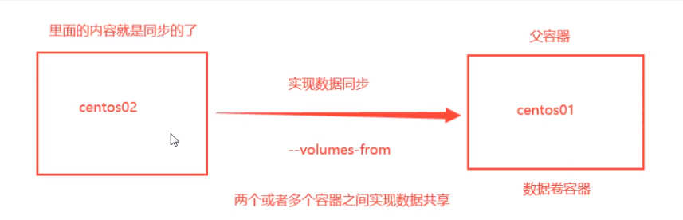
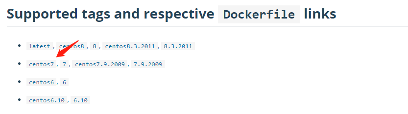
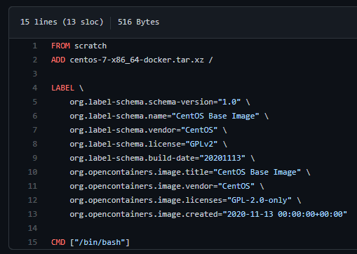
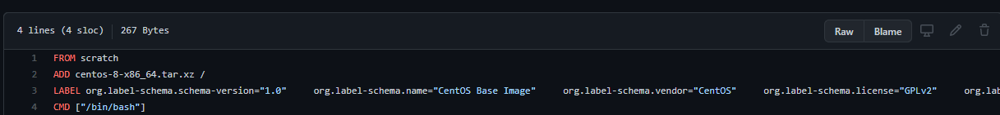

*黑发不知勤学早，白首方悔读书迟*


# 容器数据卷

## 什么是容器数据卷

> Docker 理念回顾

将应用和环境打包成一个镜像！运行镜像会生成容器。


**卷技术的背景**

* 防止容器删除后，容器中的数据也丢失
* 解决容器之间的数据共享


> 什么是卷技术

将容器中的数据同步到本地，让容器之间可以有一个数据共享的技术。


**实现原理**

目录挂载：==将容器内的目录，挂载到Linux上面==！

类似于双向绑定，且与容器是否启动无关。一个容器卷必定与外部的某个卷同步！


**为什么要用卷技术**

* 容器的持久化和同步操作
    * 将数据同步到本地，保证数据安全
    * 将配置目录同步到本地，方便修改
* 容器间数据共享


## 使用数据卷

例子：在 centos 镜像中同步目录 /hone/test 到本地

```shell
docker run -it -v /home/test:/home/test   centos:centos7 /bin/bash
```


## 实战：安装MySQL

**思考：MySQL的数据持久化的问题**

官方文档详尽：https://hub.docker.com/_/mysql

```
docker pull mysql:5.7.34

--name 别名，下次通过 docker start name 直接启动
-v 卷映射  主机/home/mysql/conf —— 映射配置目录和数据目录
-p 端口映射 主机3310
-e 环境配置，设置密码，root默认密码 my-secret-pw（注意，这是初始密码！！！）
-d 后台运行
docker run --name mysql02 -v /home/mysql/conf:/etc/mysql/conf.d -v /home/mysql/data:/var/lib/mysql -p 3310:3306 -e MYSQL_ROOT_PASSWORD=my-secret-pw -d mysql:5.7.34
```

启动后，用客户端来测试连接

	


## 从本地数据恢复容器

已知数据持久化在本地，若容器被删除了，如何用数据恢复新容器？


## 具名和匿名挂载

-v 参数

| 挂载方式 | -v 形式              | 示例                                  | 卷工作地址                      | inspect ls |
| -------- | -------------------- | ------------------------------------- | ------------------------------- | ---------- |
| 指定挂载 | -v 宿主路径:容器路径 | -v /home/mysql/conf:/etc/mysql/conf.d | /home/mysql/conf                | 不可见     |
| 匿名挂载 | -v 容器路径          | -v /etc/mysql/conf.d                  | /var/lib/docker/volumes/xxxxxxx | 可见       |
| 具名挂载 | -v 卷名称:容器路径   | -v mysql:/etc/mysql/conf.d            | /var/lib/docker/volumes/mysql   | 可见       |

```shell
# 匿名挂载
-v 容器内路径!
$ docker run -d -P --name nginx01 -v /etc/nginx nginx

docker volumn inspect 卷名称
[root@centos7 ~] docker run -d -P --name nginx02 -v nginxconf:/etc/nginx nginx
6b1ce7aa8b9ff929f1ab7825381bdd786184620a0fdfeddc4ebb472e02260c20
[root@centos7 ~] docker volume ls
DRIVER    VOLUME NAME
local     b9d257c19e03b4e396a8aa904b76e65108b48694eb7837750b5c3edc24b306eb
local     nginxconf

[root@centos7 ~] docker volume ls
DRIVER    VOLUME NAME
local     b9d257c19e03b4e396a8aa904b76e65108b48694eb7837750b5c3edc24b306eb
local     nginxconf
[root@centos7 ~] docker volume inspect nginxconf
[
    {
        "CreatedAt": "2021-06-24T20:41:13+08:00",
        "Driver": "local",
        "Labels": null,
        "Mountpoint": "/var/lib/docker/volumes/nginxconf/_data",
        "Name": "nginxconf",
        "Options": null,
        "Scope": "local"
    }
]
```


==注意==

所有的docker容器内的卷，没有指定目录的情况下都是在**/var/lib/docker/volumes/自定义的卷名/_data**下，
**如果指定了目录，docker volume ls 是查看不到的**。


==拓展==

```shell
docker run -d -P --name nginx01 -v /etc/nginx:ro nginx
docker run -d -P --name nginx01 -v /etc/nginx:rw nginx
```

ro：read only 仅允许宿主机写，容器只读

rw：read write 容器可读可写


## 初识DockerFile

Dockerfile 就是用来构建docker镜像的**构建文件**（命令脚本）

通过这个脚本可以**生成镜像**，镜像是一层一层的，脚本是一个个的命令，每个命令都是一层！


> 创建自己的centos

创建一个 dockfile 文件，脚本内容

```shell
FROM centos
RUN mkdir /volume01
VOLUME ["/volume01"]   
RUN echo "----my centos----"
RUN /bin/bash
```

`VOLUME ["/volume01", "/volume02"]`    在centos的根目录下，声明了两个容器卷，这是匿名卷，自动同步


==注意==：docker build 命令最后的 “点”

```shell
[root@centos7 home] docker build -f ./mydocker/dockfile01 -t xincan/centos:1.0 .
Sending build context to Docker daemon  207.2MB
Step 1/4 : FROM centos
latest: Pulling from library/centos
7a0437f04f83: Already exists
Digest: sha256:5528e8b1b1719d34604c87e11dcd1c0a20bedf46e83b5632cdeac91b8c04efc1
Status: Downloaded newer image for centos:latest
 ---> 300e315adb2f
Step 2/4 : VOLUME ["volume01", "volume02"]
 ---> Running in 2db66bef20d7
Removing intermediate container 2db66bef20d7
 ---> 44de15b81c10
Step 3/4 : CMD echo "----my centos----"
 ---> Running in d201f0e84dc1
Removing intermediate container d201f0e84dc1
 ---> cfc0d82726fa
Step 4/4 : CMD /bin/bash
 ---> Running in 3888d6b33352
Removing intermediate container 3888d6b33352
 ---> 8caaed48e73e
Successfully built 8caaed48e73e
Successfully tagged xincan/centos:1.0
[root@centos7 home]# docker images
REPOSITORY            TAG       IMAGE ID       CREATED          SIZE
xincan/centos         1.0       8caaed48e73e   10 seconds ago   209MB
```


启动刚生成的centos镜像

==启动报错==

```shell
[root@centos7 home] docker run -it 8caaed48e73e
docker: Error response from daemon: OCI runtime create failed: invalid mount {Destination:volume01 Type:bind Source:/var/lib/docker/volumes/cf4a841d292b366946dfef41184e3bbdd8934526a26a85db1c221e8e4c315252/_data Options:[rbind]}: mount destination volume01 not absolute: unknown.
```

错误原因：dockerfile 语法更新，VOLUME 的匿名卷语法 需要以 / 开头，否则表示具名卷，则语法错误。


**查看卷挂载**

==注意==：docker inspect 后面可以跟镜像ID和容器ID，查看挂载情况要看 容器ID！！！

```shell
# docker inspect 容器id
$ docker inspect ca3b45913df5
```


小结

* 命令都是大写的
* 每个命令就是镜像的一层


> 与commit区别

commit 也是生成镜像。

dockfile 是个生成镜像的构建脚本，可以逐步完善复制拷贝。


TODO 

type：bind 与 type：mount 的区别，即  -v 与 --mount 区别


## 数据卷容器

容器与容器之间数据共享


数据卷容器/父容器：同步数据的一方

子容器：接收数据的一方

	


白话：就是理解  --volumes-from 命令


> 多个MySQL同步数据

```shell
$ docker run -d -p 3306:3306 -v /home/mysql/conf:/etc/mysql/conf.d -v /home/mysql/data:/var/lib/mysql -e MYSQL_ROOT_PASSWORD=123456 --name mysql01 mysql:5.7

$ docker run -d -p 3310:3306 -e MYSQL_ROOT_PASSWORD=123456 --name mysql02 --volumes-from mysql01  mysql:5.7
```


# DockFile

官方文档地址：https://docs.docker.com/engine/reference/builder/


## DockerFile介绍

dockerfile是用来构建docker镜像的文件！命令参数脚本！

构建步骤：

1、 编写一个dockerfile文件

2、 docker build 构建称为一个镜像

3、 docker run运行镜像

4、 docker push发布镜像（DockerHub 、阿里云仓库、腾讯云仓库—— 云仓库也分公有私用 ？ )


**学习下官方镜像构造的方式**

以centos为例 

	

	


## DockerFile构建过程

**基础知识**：

1、每个保留关键字(指令）都是必须是大写字母

2、执行从上到下顺序

3、#表示注释

4、每一个指令都会创建提交一个新的镜像层，并提交！

	


Dockerfile是面向开发的，我们以后要发布项目，做镜像，就需要编写dockerfile文件，这个文件十分简单！

Docker镜像逐渐成企业交付的标准，必须要掌握！

DockerFile：构建文件，定义了一切的步骤，源代码

DockerImages：通过DockerFile构建生成的镜像，最终发布和运行产品。

Docker容器：容器就是镜像运行起来提供服务。


## DockerFile的指令

```shell
FROM				# from:基础镜像，一切从这里开始构建
MAINTAINER			# maintainer:镜像是谁写的， 姓名+邮箱
RUN					# run:镜像构建的时候需要运行的命令
ADD					# add:步骤，tomcat镜像，这个tomcat压缩包！添加内容 添加同目录
WORKDIR				# workdir:镜像的工作目录
VOLUME				# volume:挂载的目录
EXPOSE				# expose:保留端口配置
CMD					# cmd:指定这个容器启动的时候要运行的命令，只有最后一个会生效，可被替代
ENTRYPOINT			# entrypoint:指定这个容器启动的时候要运行的命令，可以追加命令
ONBUILD				# onbuild:当构建一个被继承DockerFile这个时候就会运行onbuild的指令，触发指令
COPY				# copy:类似ADD，将我们文件拷贝到镜像中
ENV					# env:构建的时候设置环境变量！
```

	


## 实战测试


> 创建一个 centos，包含 jdk、tomcat 的镜像

```shell
# 1./home下新建dockerfile目录
$ mkdir dockerfile

# 2. dockerfile目录下新建mydockerfile-centos文件
$ vim mydockerfile-centos

# 3.编写Dockerfile配置文件
FROM centos							# 基础镜像是官方原生的centos
MAINTAINER cao<1165680007@qq.com> 	# 作者

ENV MYPATH /usr/local				# 配置环境变量的目录 
WORKDIR $MYPATH						# 将工作目录设置为 MYPATH

RUN yum -y install vim				# 给官方原生的centos 增加 vim指令
RUN yum -y install net-tools		# 给官方原生的centos 增加 ifconfig命令

EXPOSE 80							# 暴露端口号为80

CMD echo $MYPATH					# 输出下 MYPATH 路径
CMD echo "-----end----"				
CMD /bin/bash						# 启动后进入 /bin/bash

# 4.通过这个文件构建镜像
# 命令： docker build -f 文件路径 -t 镜像名:[tag] .
$ docker build -f mydockerfile-centos -t mycentos:0.1 .
```


> cmd vs. entryponit 对比测试，加深理解

CMD 例子：*指定这个容器启动的时候要运行的命令，只有最后一个会生效，可被替代。*

```shell
$ vim dockerfile-test-cmd
FROM centos
CMD ["ls","-a"]					# 启动后执行 ls -a 命令

#cmd的情况下 -l 替换了CMD["ls","-l"] 而 -l  不是命令所以报错
# CMD 下的错误写法
docker run cmd-test:0.1 -l   

# CMD 下的正确写法，完整的名李玲
docker run cmd-test:0.1 ls -la
```


ENTRYPOINT 例子：指定这个容器启动的时候要运行的命令，可以追加命令

```shell
$ vim dockerfile-test-entrypoint
FROM centos
ENTRYPOINT ["ls","-a"]

# 我们的命令，是直接拼接在我们得ENTRYPOINT命令后面的
$ docker run entrypoint-test:0.1 -l
```


==思考==：cmd 与 entrypoint 是互斥的吗？？？


> **docker history**

查看镜像的生成过程


以centos:latest 为例，下面是 history 和 源码的对照

```shell
[root@centos7 home] docker history centos
IMAGE          CREATED        CREATED BY                                      SIZE      COMMENT
300e315adb2f   6 months ago   /bin/sh -c #(nop)  CMD ["/bin/bash"]            0B
<missing>      6 months ago   /bin/sh -c #(nop)  LABEL org.label-schema.sc…   0B
<missing>      6 months ago   /bin/sh -c #(nop) ADD file:bd7a2aed6ede423b7…   209MB
```




## 实战：Tomcat镜像


准备tomcat 和 jdk 到当前目录，编写好README

```shell
```


