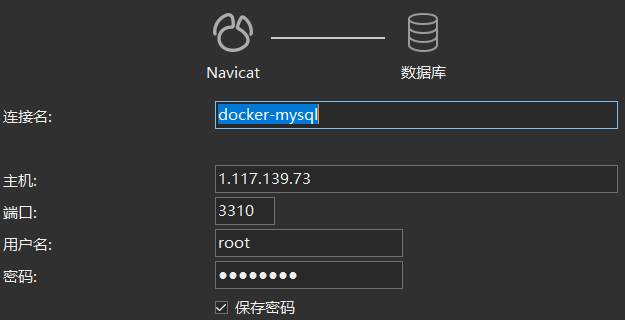

*黑发不知勤学早，白首方悔读书迟*


# 容器数据卷

## 什么是容器数据卷

> Docker 理念回顾

将应用和环境打包成一个镜像！运行镜像会生成容器。


**卷技术的背景**

* 防止容器删除后，容器中的数据也丢失
* 解决容器之间的数据共享


> 什么是卷技术

将容器中的数据同步到本地，让容器之间可以有一个数据共享的技术。


**实现原理**

目录挂载：==将容器内的目录，挂载到Linux上面==！

类似于双向绑定，且与容器是否启动无关


**为什么要用卷技术**

* 容器的持久化和同步操作
    * 将数据同步到本地，保证数据安全
    * 将配置目录同步到本地，方便修改
* 容器间数据共享


## 使用数据卷

例子：在 centos 镜像中同步目录 /hone/test 到本地

```shell
docker run -it -v /home/test:/home/test   centos:centos7 /bin/bash
```


## 实战：安装MySQL

**思考：MySQL的数据持久化的问题**

官方文档详尽：https://hub.docker.com/_/mysql

```
docker pull mysql:5.7.34

--name 别名，下次通过 docker start name 直接启动
-v 卷映射  主机/home/mysql/conf —— 映射配置
-p 端口映射 主机3310
-e 环境配置，设置密码，root默认密码 my-secret-pw（注意，这是初始密码！！！）
-d 后台运行
docker run --name mysql02 -v /home/mysql/conf:/etc/mysql/conf.d -v /home/mysql/data:/var/lib/mysql -p 3310:3306 -e MYSQL_ROOT_PASSWORD=my-secret-pw -d mysql:5.7.34
```

测试连接

	


# DockerFile


# Docker网络


